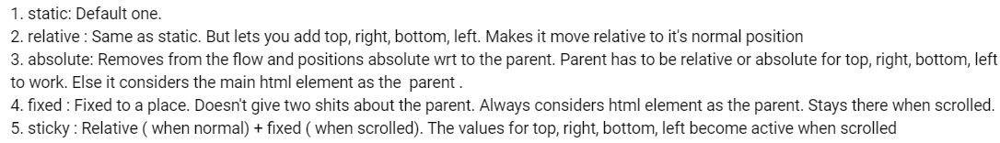

In this project, we'll be applying all the knowledge learnt so far in the FoodVilla project.

A brief about the project: This project is like a Netflix clone, wherein we show all the latest movies, shows, series etc.

We'll be exploring authentication in this project. Although authentication is mostly backend oriented, and we'll not build a NodeJS backend for the same. Instead, we'll setup a Firebase backend and connect our React application to the Firebase backend.

We'll also be exploring about protected routes (which are routes in a React application which require the user to be authenticated before accessing).

We'll also be looking at form handling: learning how to build sign-in and sign-up forms etc.

We'll also be integrating GPT APIs into the project. Let's understand about the usecases for GPT in our application: The user can search for 'funny Hindi Movies' and the recommendations for the same will be powered by GPT.

It's also important to note that the knowledge gained while building these projects are extremely helpful while building any frontend large scale application.

We'll also be focusing on styling using TailwindCSS, and making the UI of our web app look good.

## NetflixGPT Episode-1 Part-1

We built the FoodVilla project from scratch, and used Parcel as the bundler. But for the sake of this project, we'll use `create-react-app`. `create-react-app` provides a scaffold i.e. an out-of-the-box folder structure on which we can work. As an example, it will install and configure React Testing Library and Jest out of the box.

In order to create the react app, we use the syntax `npx create-react-app <project name>`.

`create-react-app` uses Webpack bundler behind the scenes.

See the package.json to see the start script, which in our case is `npm run start`.

Webpack provides Hot Module Replacement (HMR) out-of-the-box. As a recap, HMR is a feature which provides real-time updates to modules within a running application, without requiring a full page reload. This saves a lot of time during development.

Let's start by installing the dependencies of the project: TailwindCSS.

We'll start by identifying the requirements and desired features in our frontend app. This is the first and most important step during development of a project. The desired features have been discussed in [README](./README.md)

## NetflixGPT Episode-1 Part-2

We start by creating a bare-bones for the different components like Body, Header, Login and Browse. 

Let's also set up routing in the application. For now, we'll map the route '/' to Login component and '/browse' route to Browse component. We'll work on making the '/browse' route protected later. In order to set up routing in the React app, we'll leverage React Router DOM Library.

We start by designing the Login component. This component needs quite a bit of styling (which needs lots of trial and error), hence used it the same way as the instructor did. However, here's an interesting summary about CSS positions which helped a lot:

This summary is taken as a comment from this [video](https://www.youtube.com/watch?v=jx5jmI0UlXU).

Don't fret too much about the CSS, just try to understand the different properties being used in Login component. Moreover, the CSS for such designs are just a Google search away, so no worries on that part.

Let's now work on creating a sign up form. We can re-use the login form as a sign up form. We can create a state variable `isSignInForm` which stores information about whether the form is a sign-in form or not. According to the value of this state variable, we modify the verbiage on the form. The value of the state variable is toggled on click of the button due to the onClick callback passed to it.

Let's take a look at form validations : By the way, if we have a form with many fields, and we need to handle form validations and error handling, it's recommended to use a form handling library like Formik which makes things convenient.

## Lecture-1 Part-3

Let us look at validating the form in the data (like email, password) using Regex. We'll also learn the usecase of `useRef` hook while doing this.

We have a usecase to validate the email ID and password when the user signs in/signs up on the form. Now, how do we keep track of the email ID and password submitted through the input form. We can use the following two approaches:

1. Use state variables for email and password, and bind them with the input field values. However, there is a drawback in this approach: Everytime the input field value changes, the state variable changes, which triggers a re-render of the component. This impacts the performance of the application.

2. useRef is a React hook that is used to reference a value that's not needed for re-rendering. As an example, we do not want to trigger a re-render of the application everytime the input field values for email and password changes. So, we can create a reference to these input fields and use the values whenever required.

## Lecture-1 Part-4

Setting up Firebase, as well as deploying the frontend web app to Firebase.

## Lecture-1 Part-5

Let's now set up authentication using Firebase. We can refer the documentation of Firebase for this, it's quite informative. 
We are able to set up Firebase for both sign in and sign up functionalities. The next step after a user signs in or signs up successfully should be to navigate to '/browse' route, we'll be working on this next.

## Lecture-1 Part-6

Let's work on storing the user information received from the Firebase backend API upon successful sign-in/sign-up in Redux store, as this information will be reused across different components in the web app.

We'll be defining the reducer corresponding to two actions: addUser and removeUser. The action addUser will be dispatched when the user signs in/up succesfully, whereas the action removeUser will be dispatched when the user signs out of the application.

In order to dispatch the actions addUser and removeUser, we can use the following two approaches:

1. Dispatch the specific action in the respective sign-in/up/out flows.

2. Leverage `onAuthStateChanged` from Firebase which is an observer on the auth object. [Documentation](https://firebase.google.com/docs/auth/web/manage-users) 

Anytime the auth object changes due to the user signing in/up/out, the callback function passed to this observer is executed.

The second approach seems better, because it allows us to dispatch the actions in a single flow compared to the first approach where we need to handle dispatch of actions in the respective flows.

Also, one more thing to notice is that `onAuthStateChanged` is an observer (for easier understanding, we can think of it like an event listener). So, it should be executed exactly once. For this, we'll use a useEffect hook with empty dependency array.

Let's now work on the sign out functionality. We'll show the 'sign out' button on the Browse page after the user logs in. When the user clicks on 'Sign out', we need to dispatch an action to clear the user information from the store, and navigate to the home page.

We'll also work on dispatching an action to store the userName in the store, in the sign up flow.